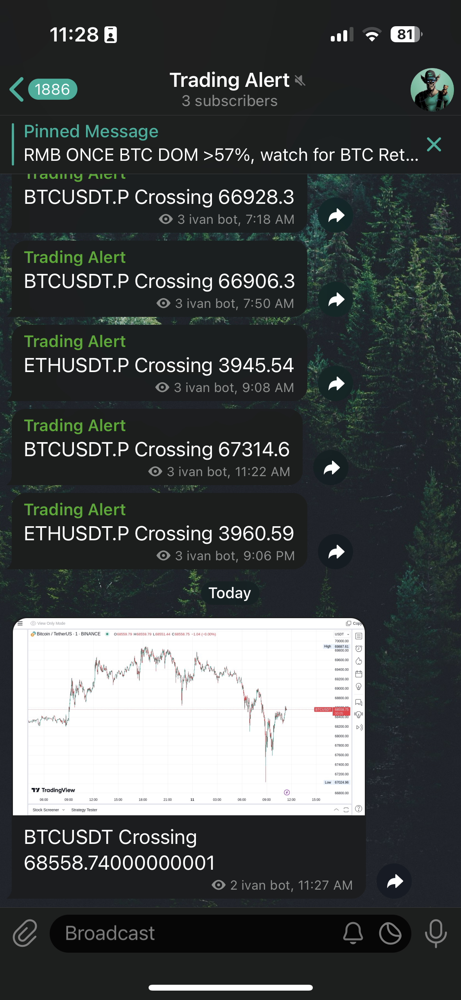

# Tradingview Alerts in Telegram
A real-time tradingview alert system that delivery 24/7 customized notifications to professional traders via Telegram for continuous market monitoring.

## Features
Able to deliver simple text messages or real-time snapshot of charts with customized captions to user's telegram. 

See image below for a demo

## Techstack used
Using docker, python and selenium

Deployed for free (?) using [fly.io](https://fly.io)