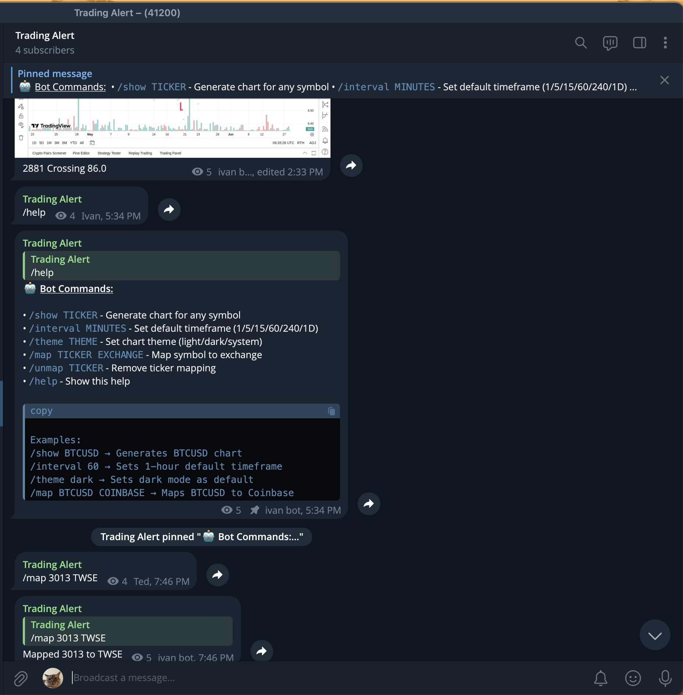

# TradingView Telegram Alerts

A simple, self-hosted FastAPI Telegram bot that receives alerts from TradingView, captures charts via Playwright, and delivers them to a Telegram channel instantly.


## Features

- **Instant alerts** from TradingView delivered to Telegram.
- **Chart screenshots** captured with Playwright (headless Chromium).
- **Async worker queue** to process chart captures without blocking webhook response.
- **Telegram commands** for custom intervals, themes, and symbol-to-exchange mapping
- **Simple self-hosting**: runs well on a Proxmox homelab LXC.



## Installation

```bash
git clone https://github.com/tedawf/tradingview-telegram-alerts.git
cd tradingview-telegram-alerts
python -m venv .venv
source .venv/bin/activate
pip install -r requirements.txt
playwright install chromium
```

.env.example

```env
TG_BOT_TOKEN=your_telegram_bot_token
TG_CHANNEL_ID=-1001234567890   # channel ID (with -100 for channels)

# for the bot to reply to your commands (not localhost!)
DOMAIN=https://your.domain.com # used by deploy.sh script to set webhook for the telegram API
```

Run:

```bash
uvicorn app.main:app --host 0.0.0.0 --port 8000
```

Send a test webhook (text/plain):

```bash
curl -X POST "http://localhost:8000/alert" -H "Content-Type: text/plain" --data "BTCUSD Crossing 123456"
```

---

## Deployment

This repo includes `deploy.sh` which:

- Activates the virtualenv
- Installs Python dependencies
- Restarts the `tvta-bot.service` systemd service
- Sets the Telegram webhook to `$DOMAIN/command`

Example tvta-bot.service:

```ini
[Unit]
Description=TradingView Telegram Alerts
After=network.target

[Service]
User=tvta_user
WorkingDirectory=/opt/tvta
ExecStart=/opt/tvta/.venv/bin/uvicorn app.main:app --host 0.0.0.0 --port 8000
Restart=always

[Install]
WantedBy=multi-user.target
```

Enable and start the service:

```bash
sudo systemctl enable tvta-bot.service
sudo systemctl start tvta-bot.service
```

Then run your `deploy.sh` on updates (`git pull`):

```bash
./deploy.sh
```

## Notes & Tips & Troubleshooting

- Use /map and /unmap to manage exchange mappings without redeploying.
- Limit `NUM_WORKERS` in main.py for low-RAM environments or increase the LXC memory.
- If Playwright fails to launch in an LXC, ensure `nesting=1` and install Playwright dependencies (`playwright install-deps`) or use a full VM.

## Contributing

Contributions are welcome - open an issue or submit a PR.

Feel free to fork this repository!
